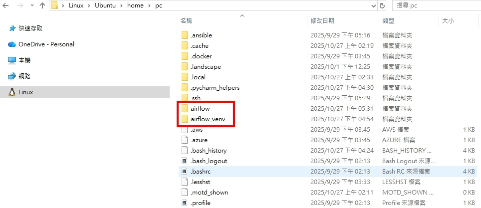

<a href='https://github.com/Junwu0615/Airflow-End-To-End-Dev'>
[](https://www.microsoft.com/zh-tw/software-download/windows10) 
[](https://github.com/Junwu0615/Airflow-End-To-End-Dev) <br>
[](https://github.com/Junwu0615/Airflow-End-To-End-Dev)
[](https://github.com/Junwu0615/Airflow-End-To-End-Dev)
[](https://github.com/Junwu0615/Airflow-End-To-End-Dev) <br>
[](https://github.com/Junwu0615/Airflow-End-To-End-Dev)
[](https://github.com/Junwu0615/Airflow-End-To-End-Dev)
[](https://github.com/Junwu0615/Airflow-End-To-End-Dev)
[](https://github.com/Junwu0615/Airflow-End-To-End-Dev)
[](https://github.com/Junwu0615/Airflow-End-To-End-Dev) <br>

<br>

## *⭐ 用 WSL2 創建 Airflow 環境 ⭐*
- #### *PowerShell ( 管理員身分 )*
  ```bash
  wsl --install -d Ubuntu
  ```

- #### *創建並進入虛擬環境*
  ```bash
  sudo apt update
  sudo apt install python3.12-venv
  sudo python3 -m venv airflow_venv
  source airflow_venv/bin/activate
  
  # 此時目錄應為 : //wsl$/Ubuntu/home/your_username
  # 創建虛擬環境位置為 : //wsl$/Ubuntu/home/your_username/airflow_venv
  ```
- 

- #### *將該目錄賦予權限給使用者*
  ```bash
  whoami # 預期輸出: your_username
  
  sudo chown -R pc:pc ~/airflow_venv
  # sudo chown -R <您的使用者名稱>:<您的使用者名稱> <虛擬環境路徑>
  # 使用 sudo chown -R 指令，將整個虛擬環境目錄的擁有權遞迴地 ($\text{-R}$) 轉移給使用者
  ```

- #### *安裝 Airflow*
  ```bash
  pip install "apache-airflow==2.9.1" --constraint "https://raw.githubusercontent.com/apache/airflow/constraints-2.9.1/constraints-3.11.txt"
  ```
  
- #### *設定 Airflow 根目錄位置*
  ```bash
  export AIRFLOW_HOME=~/airflow
  echo $AIRFLOW_HOME # 預期輸出: /home/your_username/airflow
  ```

- #### *初始化 Airflow 資料庫 ( 首次啟動前 )*
  ```bash
  airflow db migrate
  ```
  
- #### *創建管理員用戶*
  ```bash
  airflow users create \
    --username airflow \
    --firstname admin \
    --lastname user \
    --role Admin \
    --email airflow@example.com
  ```

- #### *變更預設埠*
  ```bash
  nano airflow/airflow.cfg
  # web_server_port = 8080 # <-- 改為 8150
  # 可用 VSCode 編譯器編輯
  ```
  
- #### *啟動 Airflow*
  ```bash
  airflow standalone
  ```
  
- #### *打開瀏覽器確認服務啟動*
  ```bash
  http://localhost:8150
  ```