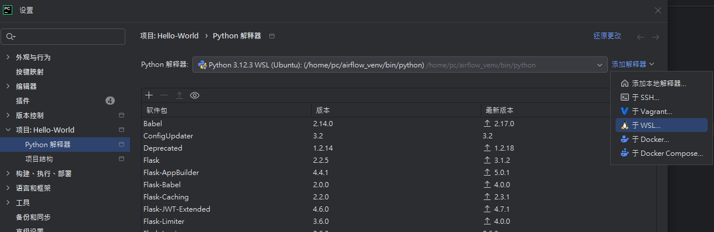
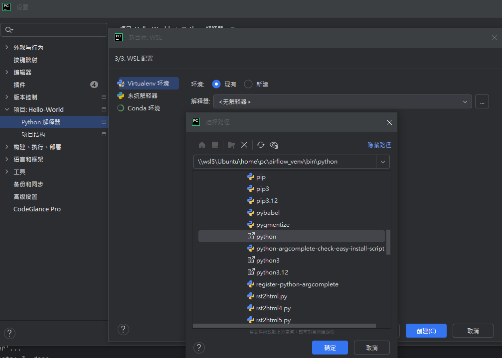
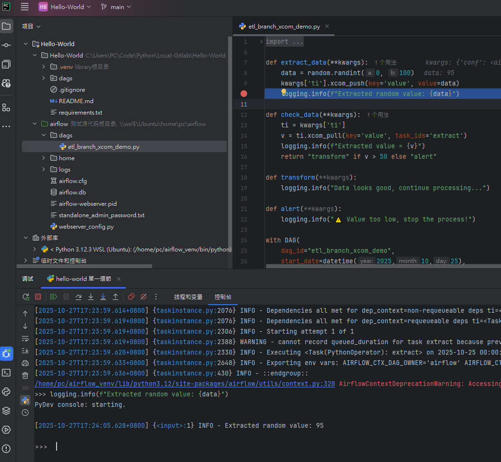

<a href='https://github.com/Junwu0615/Airflow-End-To-End-Dev'>
[](https://www.microsoft.com/zh-tw/software-download/windows10) 
[](https://github.com/Junwu0615/Airflow-End-To-End-Dev) <br>
[](https://github.com/Junwu0615/Airflow-End-To-End-Dev)
[](https://github.com/Junwu0615/Airflow-End-To-End-Dev)
[](https://github.com/Junwu0615/Airflow-End-To-End-Dev) <br>
[](https://github.com/Junwu0615/Airflow-End-To-End-Dev)
[](https://github.com/Junwu0615/Airflow-End-To-End-Dev)
[](https://github.com/Junwu0615/Airflow-End-To-End-Dev)
[](https://github.com/Junwu0615/Airflow-End-To-End-Dev)
[](https://github.com/Junwu0615/Airflow-End-To-End-Dev) <br>

<br>

## *⭐ 用 PyCharm + WSL2 + Airflow 斷點除錯指南 ⭐*
- #### *腳本參數務必設置正確*
- 
- 
- 
- 
  - #### *需要將欲 Debug 的 DAG 腳本放置正確位置*
  - #### *Airflow CLI 位置*
  ```Bash
  //wsl$/Ubuntu/home/pc/airflow_venv/bin/airflow
  ```
  - #### *腳本參數*
  ```Bash
  tasks test etl_branch_xcom_demo extract 2025-10-25
  ```
  - #### *工作目錄*
  ```Bash
  \\wsl$\Ubuntu\home\pc\airflow
  ```
  - #### *環境變數*
  ```Bash
  AIRFLOW_FORCE_SLICED_DAG_CODE=True;AIRFLOW_HOME=/home/pc/airflow;PYCHARM_DISPLAY_WSL_PATHS_AS_WINDOWS=0;PYTHONUNBUFFERED=1
  ```
- #### *成功進行 Debug*
- 

<br>

## *⭐ Other ⭐*
- #### *查閱當前環境有哪些 DAGs 腳本*
  ```Bash
  airflow dags list
  ```
- 

- #### *檢視 Airflow 當前配置*
  ```Bash
  airflow info
  ```
- 

- #### *[ 執行指令 ] 隔離測試單一 Task 的 Python 程式碼*
  ```
  # 寫入資料庫: N
  # 執行流程: 單一 Task
  # 適用時機: 程式碼除錯，不適用 XCom、資料庫連線
  
  # test: 不含 XCom / 資料庫寫入
  # 語法: airflow tasks test <DAG_ID> <TASK_ID> <EXECUTION_DATE>
  airflow tasks test etl_branch_xcom_demo extract 2025-10-27
  ```
  
- #### *[ 執行指令 ] 測試單一 Task 的完整 Airflow 行為*
  ```
  # 寫入資料庫: Y
  # 執行流程: 單一 Task
  # 適用時機: 測試 XCom、資料庫連線
  
  # run: 含 XCom / 資料庫寫入
  # 語法: airflow tasks run <DAG_ID> <TASK_ID> <EXECUTION_DATE>
  airflow tasks run etl_branch_xcom_demo extract 2025-10-27
  ```
  
- #### *[ 執行指令 ] 觸發 Scheduler 執行整個 DAG*
  ```
  # 寫入資料庫: Y
  # 執行流程: 完整 DAG
  # 適用時機: 模擬手動啟動
  
  # 語法: airflow dags trigger <DAG_ID>
  airflow dags trigger etl_branch_xcom_demo
  ```
  
- #### *[ 執行指令 ] 填補/執行歷史 DAG Run*
  ```
  # 寫入資料庫: Y
  # 執行流程: 完整 DAG
  # 適用時機: 測試排程邏輯
  
  # 語法: airflow dags backfill <DAG_ID> -s <START_DATE> -e <END_DATE>
  # 範例: 執行從 2025-10-25 開始的 DagRun
  airflow dags backfill etl_branch_xcom_demo -s 2025-10-25 -e 2025-10-25
  ```