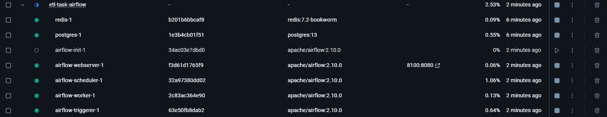

<a href='https://github.com/Junwu0615/Airflow-End-To-End-Dev'>
[](https://www.microsoft.com/zh-tw/software-download/windows10) 
[](https://github.com/Junwu0615/Airflow-End-To-End-Dev) <br>
[](https://github.com/Junwu0615/Airflow-End-To-End-Dev)
[](https://github.com/Junwu0615/Airflow-End-To-End-Dev)
[](https://github.com/Junwu0615/Airflow-End-To-End-Dev) <br>
[](https://github.com/Junwu0615/Airflow-End-To-End-Dev)
[](https://github.com/Junwu0615/Airflow-End-To-End-Dev)
[](https://github.com/Junwu0615/Airflow-End-To-End-Dev)
[](https://github.com/Junwu0615/Airflow-End-To-End-Dev)
[](https://github.com/Junwu0615/Airflow-End-To-End-Dev) <br>

<br>

## *⭐ Docker Build ⭐*
- #### *進入路徑 & 創建持久化空間*
  ```bash
  cd Airflow
  md dags; md logs; md plugins; md config
  ```
  
- #### *啟動服務*
  ```bash
  docker-compose -p etl-task-airflow up -d
  ```

- #### *檢視服務是否正確啟用*
  ```bash
  docker ps -a
  ```

- #### *關閉服務*
  ```bash
  docker-compose -p etl-task-airflow down
  ```
- 