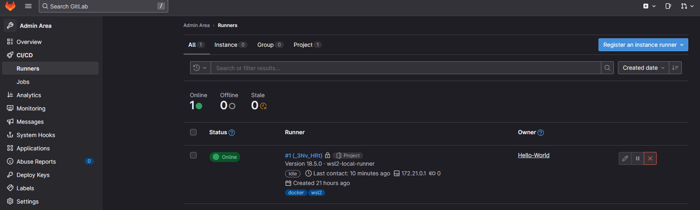
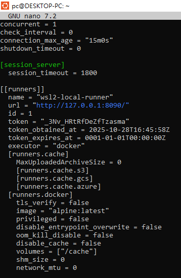
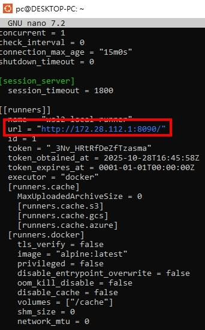

<a href='https://github.com/Junwu0615/Airflow-End-To-End-Dev'>
[](https://www.microsoft.com/zh-tw/software-download/windows10) 
[](https://github.com/Junwu0615/Airflow-End-To-End-Dev) <br>
[](https://github.com/Junwu0615/Airflow-End-To-End-Dev)
[](https://github.com/Junwu0615/Airflow-End-To-End-Dev)
[](https://github.com/Junwu0615/Airflow-End-To-End-Dev) <br>
[](https://github.com/Junwu0615/Airflow-End-To-End-Dev)
[](https://github.com/Junwu0615/Airflow-End-To-End-Dev)
[](https://github.com/Junwu0615/Airflow-End-To-End-Dev)
[](https://github.com/Junwu0615/Airflow-End-To-End-Dev)
[](https://github.com/Junwu0615/Airflow-End-To-End-Dev) <br>

<br>

## *⭐ 用 WSL2 創建 Runner 服務 ⭐*
- #### *啟動服務*
  ```bash
  # 1. 下載二進位檔案 (這裡以 x86-64 架構為例)
  sudo curl -L --output /usr/local/bin/gitlab-runner https://gitlab-runner-downloads.s3.amazonaws.com/latest/binaries/gitlab-runner-linux-amd64

  # 2. 賦予執行權限
  sudo chmod +x /usr/local/bin/gitlab-runner
  
  # 3. 創建 Runner 使用者
  sudo useradd --comment 'GitLab Runner' --create-home gitlab-runner --shell /bin/bash
  
  # 4. 安裝為服務 (讓它可以在背景運行)
  sudo gitlab-runner install --user=gitlab-runner --working-directory=/home/gitlab-runner
  
  # 5. 啟動服務
  sudo gitlab-runner start
  ```
  
- #### *執行註冊命令*
  ```bash
  sudo gitlab-runner register
  ```

- #### *按照指示註冊*
  ```bash
  # 1. 輸入 GitLab 伺服器 URL: http://127.0.0.1:8090/ (根據你的 GitLab 伺服器地址進行修改)
  # 2. 輸入註冊 Token (在 GitLab 專案的 Settings > CI/CD > Runners settings 中找到)
  # 3. 輸入描述: wsl2-local-runner
  # 4. 輸入標籤: docker,wsl2
  # 5. 執行器類型: docker
  # 6. Docker 映像: alpine:latest
  ```

- #### *檢視服務是否呈現綠點*
- 

- #### *檢視服務運行狀況*
  ```bash
  sudo service gitlab-runner status
  ```

- #### *檢視服務是否能正確連接到 Gitlab*
  ```bash
  sudo nano /etc/gitlab-runner/config.toml
  
  # 若有進行變更，請重啟服務
  sudo gitlab-runner restart
  ```
- 
- 