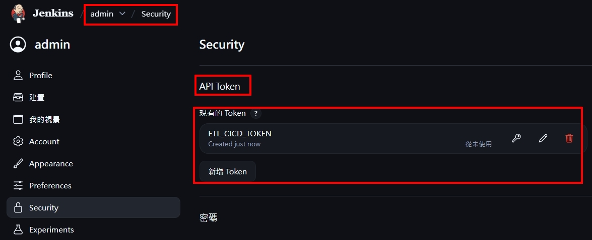

<a href='https://github.com/Junwu0615/Airflow-End-To-End-Dev'>
[](https://www.microsoft.com/zh-tw/software-download/windows10) 
[](https://github.com/Junwu0615/Airflow-End-To-End-Dev) <br>
[](https://github.com/Junwu0615/Airflow-End-To-End-Dev)
[](https://github.com/Junwu0615/Airflow-End-To-End-Dev)
[](https://github.com/Junwu0615/Airflow-End-To-End-Dev) <br>
[](https://github.com/Junwu0615/Airflow-End-To-End-Dev)
[](https://github.com/Junwu0615/Airflow-End-To-End-Dev)
[](https://github.com/Junwu0615/Airflow-End-To-End-Dev)
[](https://github.com/Junwu0615/Airflow-End-To-End-Dev)
[](https://github.com/Junwu0615/Airflow-End-To-End-Dev) <br>

<br>

## *⭐ 用 WSL2 創建 Jenkins 服務 ( 貌似可直接在 Docker Desktop 直接部署 )⭐*
- #### *進入路徑 & 創建持久化空間*
  ```bash
  cd Jenkins
  md jenkins_home
  ```

- #### *啟動服務*
  ```bash
  docker-compose -p etl-task-jenkins up -d
  ```
- 

- #### *檢視服務是否正確啟用*
  ```bash
  docker ps -a
  ```

- #### *關閉服務*
  ```bash
  docker-compose -p etl-task-jenkins down
  ```
  
- #### *查看初始化密碼*
  ```bash
  docker exec -it jenkins cat /var/jenkins_home/secrets/initialAdminPassword
  ```

- #### *Jenkins Plugin 必裝清單 ( 無腦選擇推薦安裝 )*
  | 插件名稱 | 用途 |
  | :-- | :-- |
  | Git plugin | 從 GitLab 拉原始碼 |
  | GitLab plugin| 接收 GitLab Webhook |
  | Pipeline plugin | 支援 Jenkinsfile 腳本 |
  | SSH Agent plugin | 用 SSH 部署至 Airflow |
  | Credentials Binding plugin | 管理 Token / SSH key |
  | Blue Ocean [可選] | 視覺化 Pipeline 介面 |
- 

- #### *設定使用者，即進入 UI 介面*
  ```bash
  Account: admin
  Password: admin_pass
  Email: admin@example.com
  ```

- #### *確認是否安裝 Gitlab 插件*
- 

  
<br>

## *⭐ 單一專案如何建立 CI/CD Pipline ⭐*
- #### *⭐ Gitlab Runner + Docker Volume 架構概念 ⭐*
  ```Bash
  # 單一環境啟太多服務 無法用 Webhook 觸發部署
  # 改用 Gitlab Runner 觸發 Jenkins 部署
  
  GitLab [push / merge]
  
       ↓  Gitlab Runner CI [Trigger]
  
  Jenkins CD
  
       ↓  Docker Volume Copy
  
  Airflow CLI Trigger
  ``` 
  
- #### *新增作業步驟*
  - 
    ```Bash
    來自 Gitlab 專案 Hello World 發生 Commit 動作，間接觸法 Jenkins CI/CD 流程
    ``` 
  - 

- #### *設定 Jenkins Token*
- 
    ```Bash
    # 最後觸發路徑如下
    http://192.168.0.158:8095/job/Hello-World-ETL/build?token=???
    ``` 

- #### *在 WSL2 啟動 [Gitlab Runner](../GitLab-Runner/README.md)*

- #### *在 GitLab 專案中建立 .gitlab-ci.yaml*


[//]: # (- #### *申請 GitLab Access Tokens &#40; API &#41;*)
[//]: # (- ![PNG]&#40;../sample/jenkins_13.jpg&#41;)
[//]: # ()
[//]: # (- #### *建立 GitLab Webhook Token*)
[//]: # (- ![PNG]&#40;../sample/jenkins_14.jpg&#41;)
[//]: # (    ```Bash)
[//]: # (    # gitlab)
[//]: # (    # http://host.docker.internal:8090)
[//]: # (    ``` )
[//]: # (- ![PNG]&#40;../sample/jenkins_15.jpg&#41;)
[//]: # ()
[//]: # (- #### *在 GitLab 專案設定 Webhook*)
[//]: # (    ```Bash)
[//]: # (    http://192.168.0.158:8095/jenkins/job/Hello-World-ETL)
[//]: # (    http://host.docker.internal:8095/jenkins/job/Hello-World-ETL/)
[//]: # (    ``` )
[//]: # (- ![PNG]&#40;../sample/jenkins_16.jpg&#41;)