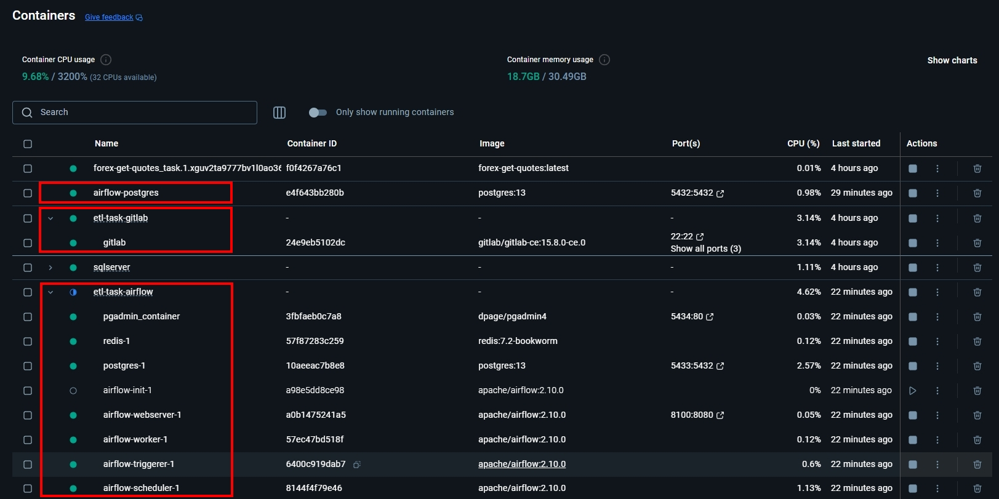
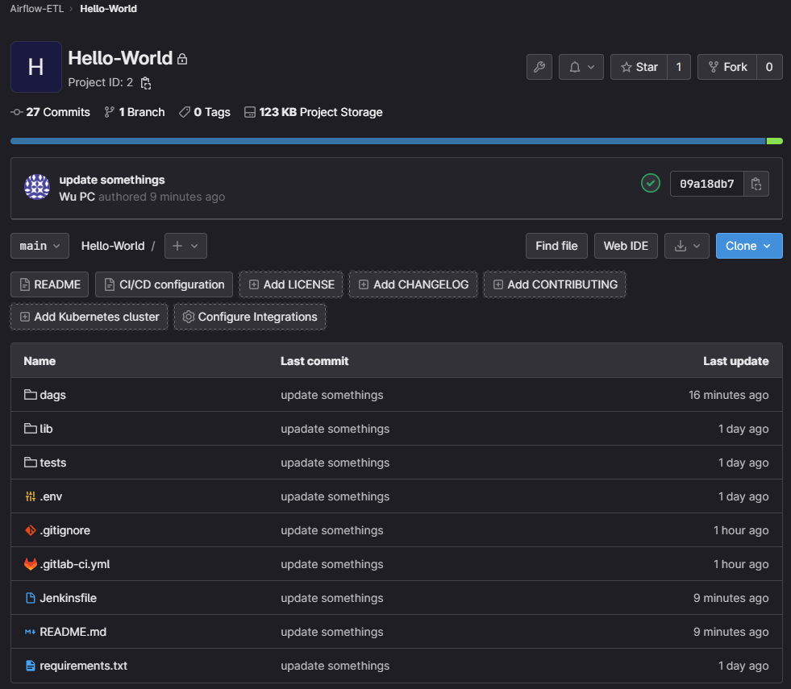
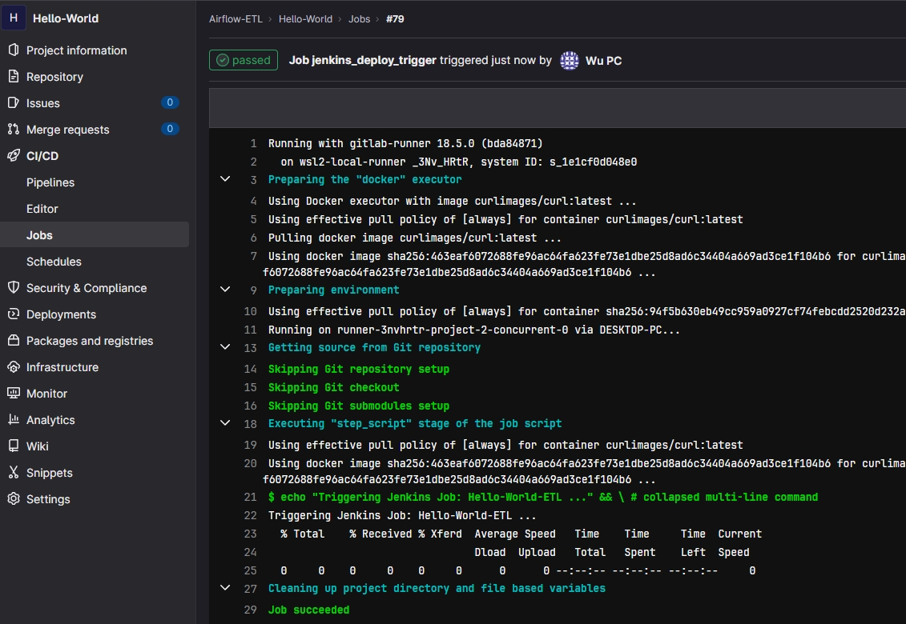
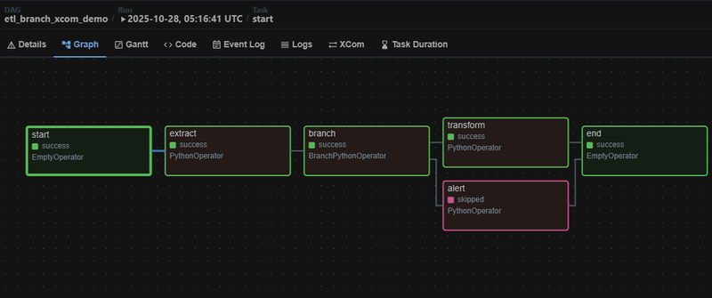
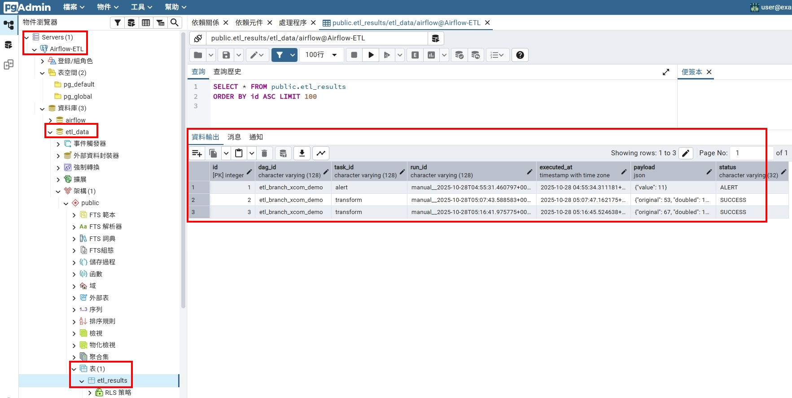

<a href='https://github.com/Junwu0615/Airflow-End-To-End-Dev'>
 
  

  

  

 

## *⭐ Airflow-End-To-End-Dev ⭐*

### *A.　Current Progress*
|**項目**|**敘述**|**完成時間**|
|:--:|:--:|:--:|
| 專案上架 | - | 2025-10-26 |
| 部署 GitLab | 第 1 階段 | 2025-10-26 |
| 部署 Airflow | 第 1 階段 | 2025-10-26 |
| 地端開發除錯測試 | 第 1 階段 | 2025-10-27 |
| ETL 腳本範例測試 | 第 1 階段 | 2025-10-27 |
| 部署 Jenkins | 第 2 階段 | 2025-10-28 |
| 啟動 Gitlab Runner | 第 2 階段 | 2025-10-28 |
| Jenkins CI/CD 管道建立 | 第 2 階段 | 2025-10-29 |
| Telegram Alert 機制建立 | 第 2 階段 | - |
| 部署 Grafana + Loki | 第 3 階段 | - |
| Grafana + Loki 監控機制建立 | 第 3 階段 | - |
| 部署 ELK | 第 3 階段 | - |
| ELK 監控機制建立 | 第 3 階段 | - |
| ??? | 第 4 階段 | - |

 

### *B.　Technology Stack*
| **階段** | **重點目標** | **完成標誌** |
| :--: | :--: | :--: |
| 第 1 階段：核心運行雛形 | Airflow + Docker + Python DAG + GitLab | 可執行 DAG，具備基本 ETL 能力 |
| 第 2 階段：自動化與通知 | Jenkins CI/CD + Telegram Alert | 每次推送自動部署、任務失敗即時通知 |
| 第 3 階段：監控與可視化 | Grafana + Loki + ELK | 可追蹤任務日誌與系統狀態 |
| 第 4 階段：擴充與品質治理 | Terraform / DBT / Great Expectations | 強化擴充性與資料品質控管 |

 

### *C.　Service List*
| **項目** | **服務定位** | **服務狀態** | **服務位置** | **說明文件** |
|:--:|:--:|:--:|:--:|:--|
| GitLab | 伺服器服務 | Online | [8090](http:127.0.0.1:8090) | [部署方式.md](./GitLab/README.md) |
| Airflow | 伺服器服務 | Online | [8100](http:127.0.0.1:8100) | [部署方式.md](./Airflow/README.md) |
| PostgreSQL | 伺服器服務 | Online | [5433](http:127.0.0.1:5433) | With Airflow Docker-compose |
| PostgreSQL UI | 伺服器服務 | Online | [5434](http:127.0.0.1:5434) | With Airflow Docker-compose |
| Airflow Standalone | 純開發環境 | Local | [8150](http:127.0.0.1:8150) | [部署方式.md](./Airflow/Airflow-Standalone/Deploy.md) \| [開發說明.md](./Airflow/Airflow-Standalone/Dev.md) |
| Jenkins | 伺服器服務 | Online | [8095](http://127.0.0.1:8095/jenkins) | [部署方式.md](./Jenkins/README.md) |
| Grafana + Loki | 伺服器服務 | Online | - | - |
| ELK | 伺服器服務 | Online | - | - |

 

### *D.　Show Somethings*
- #### *A.　當前已啟動容器項目*
- 
- #### *B.　開發流程*
  - #### *B.1　GitLab Commit : 將開發腳本上傳程式庫*
  - 
  - #### *B.2　Jenkins CI/CD : 確認執行情況*
  - 
  - #### *B.3　Airflow : 檢查上線版本是否出現 DAGs*
  - 
  - #### *B.4　PostgreSQL UI : 檢查資料入庫*
  - 